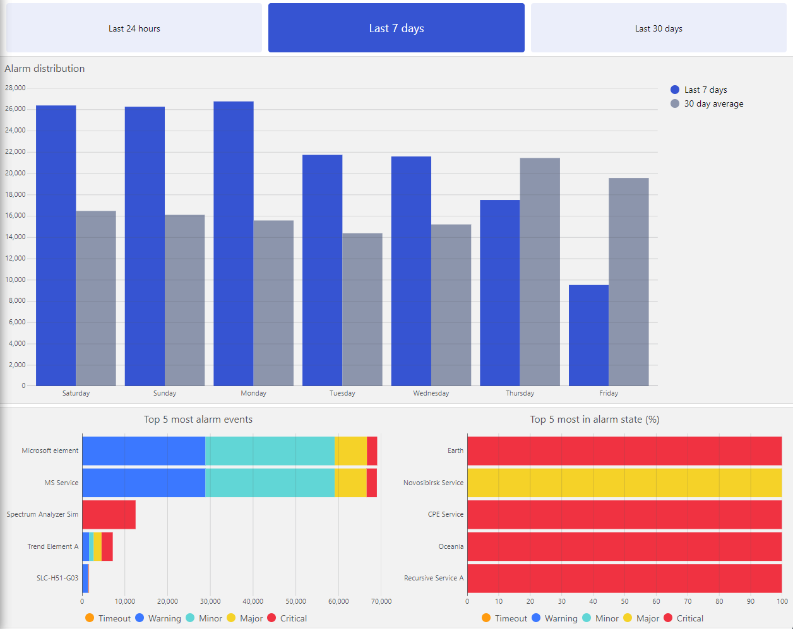

# Alarm Report

## About

This alarm report will help increase the visibility of the alarms in your environment.

## Key Features

- Shows the alarm distribution for a given period.
- Makes elements that generate a large number of alarm events stand out.
- Provides alarm state visibility for your elements.

## Prerequisites

- The minimum required DataMiner version for this package is **10.4.9.0-14794**. Please, make sure your current system meets this requirement before you start the installation.

## Installation and Configuration

1. Click the **Deploy** button to deploy the package directly to your DataMiner System.
2. Optionally, go to [admin.dataminer.services](https://admin.dataminer.services), and verify whether the deployment was successful.
3. Go to `http(s)://[DMA name]/dashboard`.
4. Select the **Alarm Report** dashboard.

## Support

For additional help, please reach out to [DataMiner Support](mailto:support@dataminer.services).
